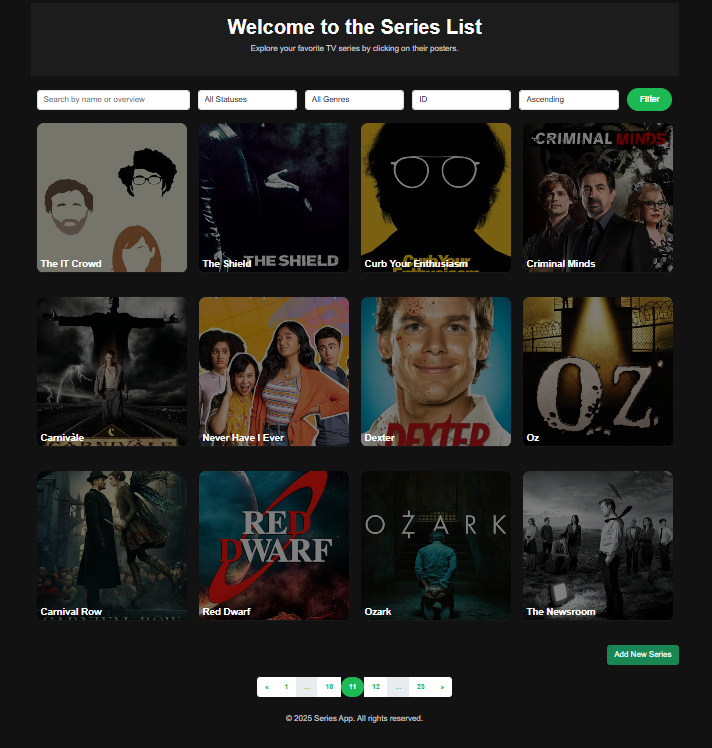

# Series Management Website

## Description

This project is a **Series Management Website** built using the Symfony framework. It allows users to explore, add, and manage TV series. The website provides features such as filtering series by name, status, genre, and sorting them by various attributes like popularity and votes. Users can also view detailed information about each series, including its seasons and posters.

The website is accessible at the server's configured URL (e.g., `http://localhost/series`).

### Preview



## Features

- **Series List**: Browse a list of TV series with filters for name, status, genre, and sorting options.
- **Series Details**: View detailed information about a series, including its overview, status, genres, and season posters.
- **Add New Series**: Add new series with details like name, overview, status, genres, and upload a poster.
- **Delete Series**: Delete a series along with its associated poster.
- **Responsive Design**: Fully responsive design for both desktop and mobile devices.

## Technologies Used

- **Symfony Framework**: Backend framework for building the application.
- **Twig**: Templating engine for rendering views.
- **Doctrine ORM**: For database interactions.
- **Bootstrap**: For responsive design and styling.
- **MySQL**: Database for storing series information.
- **HTML/CSS/JavaScript**: Frontend technologies for building the user interface.

## Installation and Setup

Follow these steps to set up the project locally:

1. **Clone the Repository**:
   
   ```bash
   git clone https://github.com/your-username/series-management.git
   cd series-management

2. **Install Dependencies**:

- Make sure you have Composer installed. Run the following command to install PHP dependencies:

   ```bash
    composer install

3. **Set Up the Database**:
   
- Update the .env file with your database credentials. For example:
   
    ```bash
    DATABASE_URL="mysql://root:@127.0.0.1:3306/series"
    
- Then, create the database and run migrations:

    ```bash
    php bin/console doctrine:database:create
    php bin/console doctrine:migrations:migrate
    
- Load Fixtures (Optional): If you want to load sample data, run:

    ```bash
    php bin/console doctrine:fixtures:load

4. **Run the Development Server**:

- Start the Symfony development server:
    
    ```bash
    symfony server:start

- The website will be accessible at the server's configured URL (e.g., http://localhost/series).


## Usage

Navigate to the Series List to browse all series.

Use the filters to search for specific series by name, status, or genre.

Click on a series poster to view its details.

Add a new series by clicking the "Add New Series" button.

Delete a series by clicking the "Delete" button on the series details page.


## Project Structure


The project follows the standard Symfony directory structure:

src/Controller: Contains controllers like SerieController for handling requests.

src/Entity: Contains the Serie entity for database interactions.

src/Form: Contains the SerieType form class for handling series forms.

templates/: Contains Twig templates for rendering views.

public/: Contains static assets like images, CSS, and JavaScript files.


## Feedback and Suggestions

Feel free to offer any suggestions or improvements to make this project even better! 
Contributions are welcome, and you can submit a pull request or open an issue on the GitHub repository.


